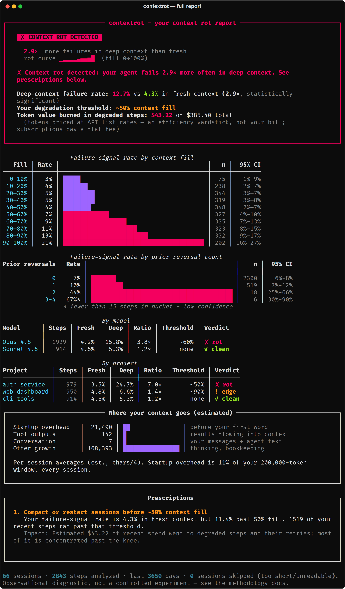
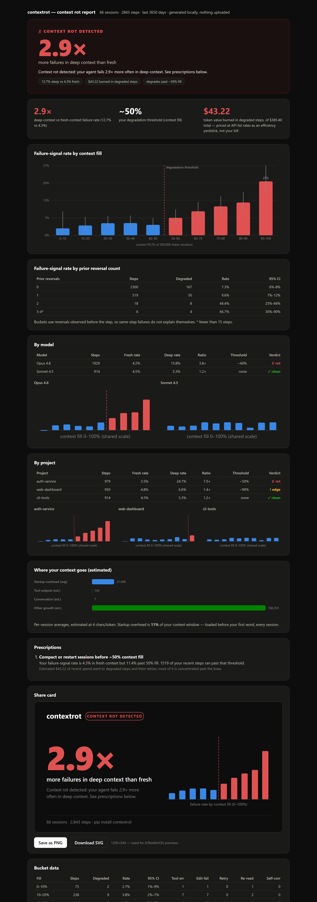
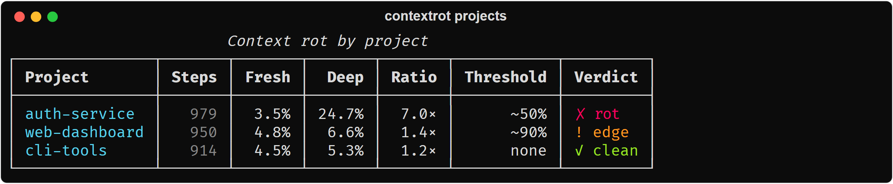
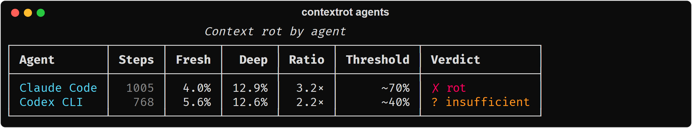
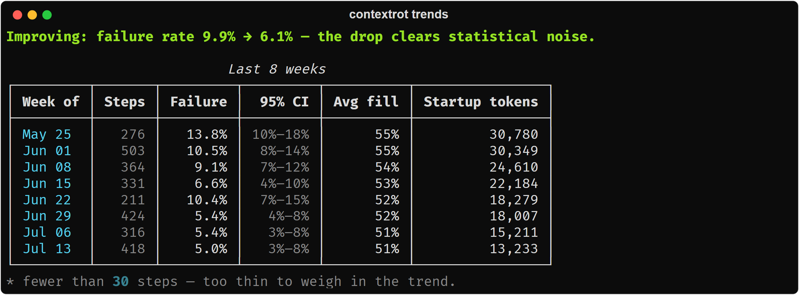
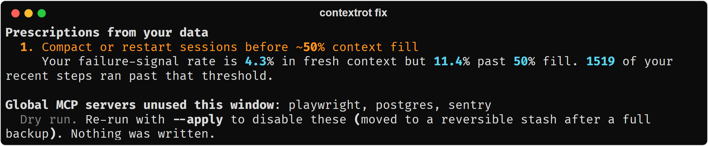
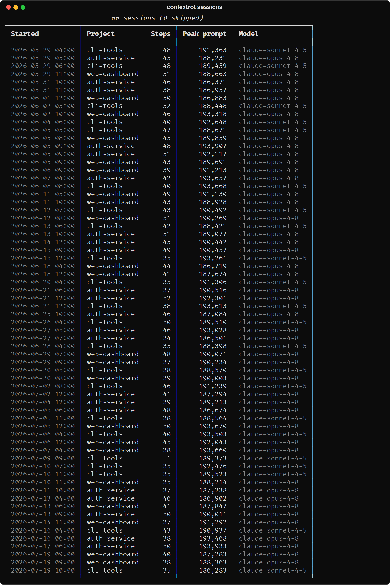
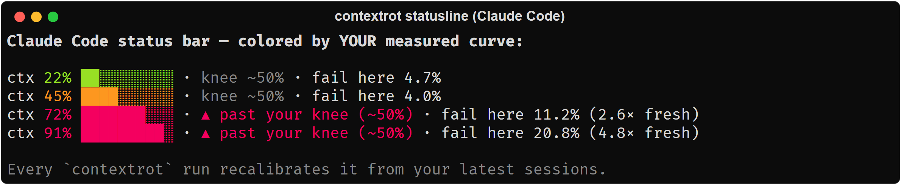
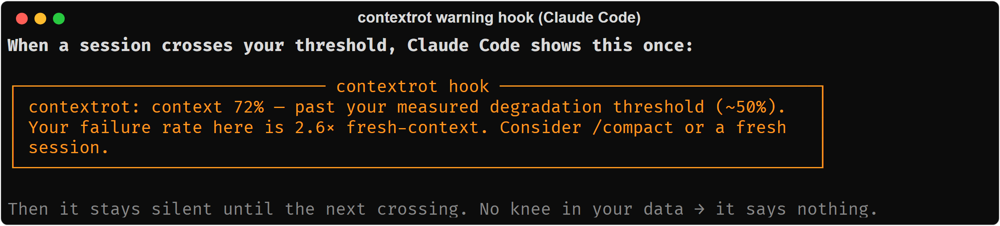

<div align="center">
  <h1>contextrot — every feature, in pictures</h1>
  <p><strong>A quick visual tour of what the tool shows you.</strong><br>
  One command reads the session logs your coding agent already saved and tells you
  where it starts getting worse. Everything runs on your machine — no API keys, no uploads.</p>
  <p><em>All screenshots below are from a synthetic demo dataset, so no real project
  names appear. Your own report uses your real sessions.</em></p>
  <p><a href="README.md">← back to the README</a> · <a href="#install">install</a></p>
</div>

---

## The report — where does your agent start failing?

`contextrot`

The headline is a plain verdict — **rot**, **edge rot**, **clean**, or **not enough data** —
followed by the exact context-fill % where you start failing, a failure-rate curve with
confidence intervals, where your context is being spent, and concrete fixes. Use more than
one model and it compares them head-to-head automatically (here Opus rots 3.8× while Sonnet
stays flat on the same work).

<div align="center">
  
</div>

### The same report as a shareable HTML page

`contextrot --html report.html`

One self-contained local file (still zero network) with a built-in 1200×630 share card you
can save as a PNG and post.

<div align="center">
  
</div>

---

## Which of your repos rots first?

`contextrot projects`

An independent curve and verdict per project, ranked worst-first — so the specific repo whose
`CLAUDE.md` or MCP setup is dragging you down stops hiding inside your all-projects average.

<div align="center">
  
</div>

## Which coding agent rots first?

`contextrot agents`

Claude Code vs Codex CLI vs Gemini CLI vs Cline — each with its own curve and verdict on a
shared scale, measured on *your* workload rather than a benchmark's.

<div align="center">
  
</div>

---

## Are you actually improving?

`contextrot trends`

Week-over-week failure rate and startup-overhead bloat, with an honest verdict on whether the
change cleared statistical noise. This is the before/after check for `contextrot fix`.

<div align="center">
  
</div>

## What should you actually change?

`contextrot fix`

Turns the report's findings into concrete actions, and points out MCP servers you configured
but never actually use. **Dry-run by default — it writes nothing** unless you add `--apply`
(which backs up first and is reversible).

<div align="center">
  
</div>

## What sessions were parsed?

`contextrot sessions`

A plain list of everything that was read, with each session's peak context fill.

<div align="center">
  
</div>

---

## Use it live, inside Claude Code

The report tells you where you degrade *after the fact*. These put it in front of you **while
you're working** — and they're the reason a Claude Code user gets the most out of contextrot.
All three are dry-run by default, write only with `--apply`, back up your settings first, and
undo cleanly with `contextrot uninstall`.

### A live context-health meter in your status bar

`contextrot install statusline --apply`

Your current context fill, colored against your *own* measured curve — not a generic
"yellow at 70%." It knows where *you* start failing, and recalibrates on every run.

<div align="center">
  
</div>

### A one-time warning the moment you cross your threshold

`contextrot install hook --apply`

One nudge, the instant a session crosses *your* measured failure threshold — then silence
until the next crossing. No knee in your data? It says nothing at all.

<div align="center">
  
</div>

### Let Claude Code check its own rot, mid-task

`claude mcp add contextrot -- contextrot mcp`

Runs contextrot as an MCP server so Claude Code itself can pull your rot report during a
session and decide to compact, warn you, or switch models. Still zero network — a local pipe,
not a socket.

---

## Install

```bash
uvx contextrot
# or
pip install contextrot
contextrot
```

No config, no API keys, no uploads. contextrot makes **zero network calls** — local files in,
terminal or local HTML out.

<div align="center">
  <strong>Ran it on your own sessions?</strong>
  <a href="https://github.com/Priyanshu-byte-coder/contextrot/discussions/8">Share your rot curve</a>
  — flat curves count too. If it told you something useful, a ⭐ helps other agent users find it.
</div>
