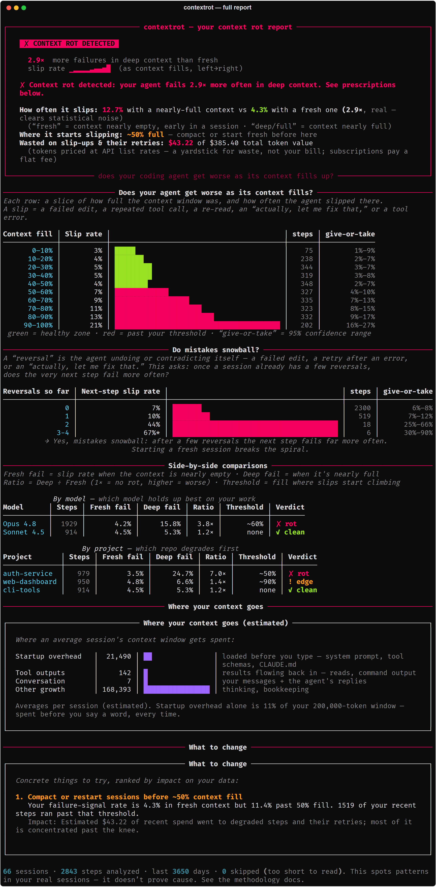
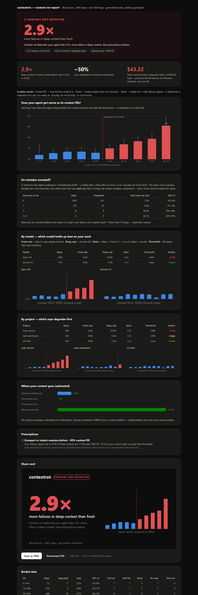
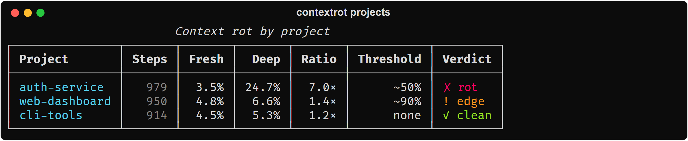
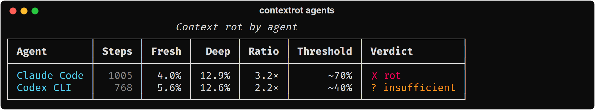
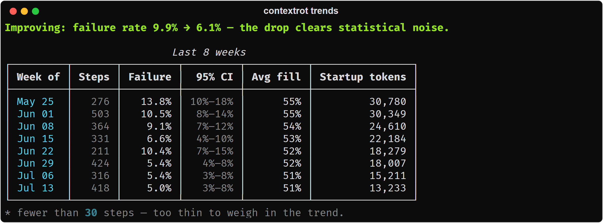
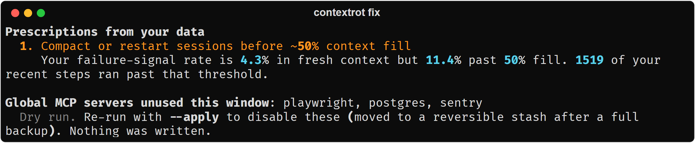
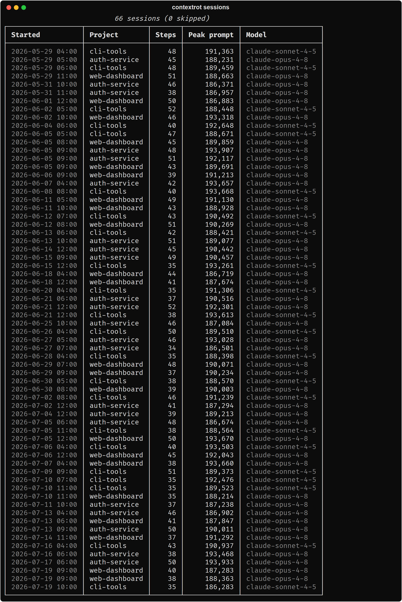
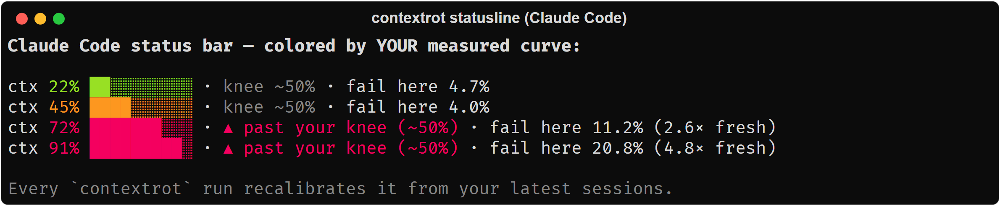
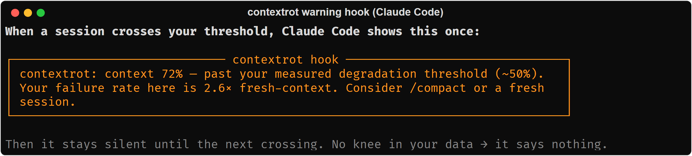

<div align="center">
  <h1>contextrot — every feature, in pictures</h1>
  <p><strong>A quick visual tour of what the tool shows you.</strong><br>
  One command reads the session logs your coding agent already saved and tells you
  where it starts getting worse. Everything runs on your machine — no API keys, no uploads.</p>
  <p><em>All screenshots below are from a synthetic demo dataset, so no real project
  names appear. Your own report uses your real sessions.</em></p>
  <p><a href="README.md">← back to the README</a> · <a href="#install">install</a></p>
</div>

---

## The answer, in fifteen seconds

`contextrot`

The default report answers three questions and stops: **am I degrading, what is it costing me,
and what should I change.** Everything else is one flag away.

```
 ✓ NO MEASURABLE ROT

  Your agent slips 3.3% of the time when the context is nearly full, against
  4.0% when it's fresh. Filling the window is not what's hurting your output.

  Measured on 28,617 steps from the last 30 days.
  3.4% of your token spend went to steps that slipped — retries, failed edits
  and re-reads that produced nothing.

  What to do
  → Nothing about context fill — your setup is holding up.

  Run contextrot --full for the curve behind this, the comparisons, and where
  your context goes.
```

The rule behind every line: if it wouldn't change what you do next, it lives in `--full`.

---

## The full analysis — where exactly does it start failing?

`contextrot --full`

The headline is a plain verdict — **rot**, **edge rot**, **clean**, or **not enough data** —
followed by the exact context-fill % where you start failing, a failure-rate curve with
confidence intervals, where your context is being spent, and concrete fixes. Use more than
one model and it compares them head-to-head automatically (here Opus rots 3.8× while Sonnet
stays flat on the same work).

<div align="center">
  
</div>

### The same report as a shareable HTML page

`contextrot --html report.html`

One self-contained local file (still zero network) with a built-in 1200×630 share card you
can save as a PNG and post.

<div align="center">
  
</div>

---

## Which of your repos rots first?

`contextrot projects`

An independent curve and verdict per project, ranked worst-first — so the specific repo whose
`CLAUDE.md` or MCP setup is dragging you down stops hiding inside your all-projects average.

<div align="center">
  
</div>

## Which coding agent rots first?

`contextrot agents`

Claude Code vs Codex CLI vs Gemini CLI vs Cline — each with its own curve and verdict on a
shared scale, measured on *your* workload rather than a benchmark's.

<div align="center">
  
</div>

---

## Are you actually improving?

`contextrot trends`

Week-over-week failure rate and startup-overhead bloat, with an honest verdict on whether the
change cleared statistical noise. This is the before/after check for `contextrot fix`.

<div align="center">
  
</div>

## What is the rot actually costing you?

`contextrot waste`

Usage trackers can tell you what you spent. None of them can tell you which part was **wasted**,
because that needs the failure signals: a retry of a call that already errored, an edit that
missed, a re-read of a file still sitting in context. Those tokens were paid for and bought
nothing.

```
  3.4% of your token spend went to steps that slipped
  1,082 of 28,701 steps over the last 30 days · $248.91 of $7,342.39 at API list prices

  What went wrong                              Steps     Cost
  Tool calls that errored                        581  $137.99
  Files re-read that were already in context     337   $71.74
  Same call repeated after an error              161   $36.04
  Edits that missed their target                  44    $8.48
  “actually, let me fix that”                     27    $8.49
```

One step can trip several of these, so the rows overlap and the output says so rather than
apportioning a precision that isn't there. `--json` included, labelled with its pricing basis
(API list prices — on a subscription that's "what this would have cost", not a bill you got).

---

## What should you actually change?

`contextrot fix`

Turns the report's findings into concrete actions, and points out MCP servers you configured
but never actually use. **Dry-run by default — it writes nothing** unless you add `--apply`
(which backs up first and is reversible).

<div align="center">
  
</div>

## What sessions were parsed?

`contextrot sessions`

A plain list of everything that was read, with each session's peak context fill.

<div align="center">
  
</div>

---

## Use it live, inside Claude Code

The report tells you where you degrade *after the fact*. These put it in front of you **while
you're working** — and they're the reason a Claude Code user gets the most out of contextrot.
All three are dry-run by default, write only with `--apply`, back up your settings first, and
undo cleanly with `contextrot uninstall`.

### A live context-health meter in your status bar

`contextrot install statusline --apply`

Your current context fill, colored against your *own* measured curve — not a generic
"yellow at 70%." It knows where *you* start failing, and recalibrates on every run.

```
ctx 34% ███▍░░░░░░ · 340k/1M · ~45 turns left
ctx 85% ████████▌░ · 850k/1M · ~10 turns left, ~2 heavy · ▲ past threshold ~70% · slip 9.2% — 1.9× fresh
ctx 99% █████████▉ · 198k/200k · no room for another turn
```

**Headroom in the unit you plan in.** `660k left` is precise and abstract; `~45 turns left` is
the thing you decide with. It's measured from your own history — the median turn adds a certain
number of tokens, so what remains divides into roughly that many more turns. Under 12 it goes
yellow and adds the heavy case, because one wide grep can cost several times a typical turn.

**The threshold is the one for what you're running right now.** Curves are stored per agent, per
model and per pair, and the line resolves the narrowest that fits your session. When it has to
borrow from a broader slice it says so — `(all agents)` — rather than passing it off as yours.

**When nothing is wrong, it says nothing.** A clean curve renders no health text at all; the
green bar is the message.

<div align="center">
  
</div>

### A one-time warning the moment you cross your threshold

`contextrot install hook --apply`

One nudge, the instant a session crosses *your* measured failure threshold — then silence
until the next crossing. It uses the threshold for the model actually running, not a blend.
No threshold in your data? It says nothing at all.

<div align="center">
  
</div>

### Let Claude Code check its own rot, mid-task

`claude mcp add contextrot -- contextrot mcp`

Runs contextrot as an MCP server so Claude Code itself can pull your rot report during a
session and decide to compact, warn you, or switch models. Still zero network — a local pipe,
not a socket.

---

## Which curve is the statusline quoting?

`contextrot doctor`

Thresholds differ by agent and by model, so `doctor` tables every curve that was measured and
stored — and flags the ones that blend across slices you're not currently using.

```
  Measured curve           Steps  Threshold  Measured to
  Claude Code + Opus 5    21,367  none                 —
  Claude Code + Opus 4.8   3,619  none          60% full
  Claude Code + Fable 5    2,484  none          40% full
  Opus 5                  21,378  none                 —  blends all agents
  Claude Code             28,269  none                 —  blends all models
  all agents and models   28,448  none                 —  blends all agents
  Live surfaces use the narrowest of these that fits your current session.
```

It also explains which agents were found, where it looked, and what's still missing when you
have no verdict yet.

---

## Install

```bash
uvx contextrot
# or
pip install contextrot
contextrot
```

No config, no API keys, no uploads. contextrot makes **zero network calls** — local files in,
terminal or local HTML out.

<div align="center">
  <strong>Ran it on your own sessions?</strong>
  <a href="https://github.com/Priyanshu-byte-coder/contextrot/discussions/8">Share your rot curve</a>
  — flat curves count too. If it told you something useful, a ⭐ helps other agent users find it.
</div>
