<div align="center">
  <h1>contextrot — every screen</h1>
  <p><strong>What each command shows you, and what to do with it.</strong></p>
  <p><em>Every image here is generated from a synthetic dataset by
  <a href="scripts/make_showcase_data.py"><code>make_showcase_data.py</code></a> and
  <a href="scripts/capture_showcase.py"><code>capture_showcase.py</code></a> — three made-up
  projects, two agents, four models — so no real project, path or person appears, and any
  screen can be regenerated after a change. Your own report uses your real sessions.</em></p>
  <p><a href="README.md">← back to the README</a></p>
</div>

---

## The answer

`contextrot`

The verdict first, then the one or two facts behind it, the strongest other thing moving
your failure rate, what it's costing, and what to change. Three next steps at the bottom —
including the live surface that fits the agent you actually use.

<div align="center">
  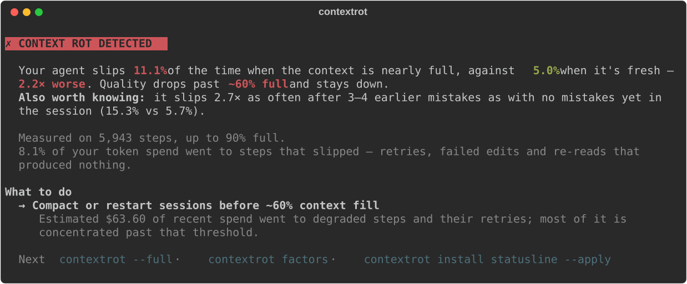
</div>

Here the agent slips 2.2× as often with a nearly full context as with a fresh one, and the
damage starts around 60%. On your own sessions the answer may well be *no rot at all* —
lab benchmarks find it under conditions real work often never reaches, and the report will
say so plainly rather than invent a threshold.

## What actually moves the failure rate

`contextrot factors`

Context fill is one suspect. This checks the rest with the same statistics and ranks them.
**●** clear means the two groups' confidence ranges don't overlap; **◐** maybe means they do;
**○** means no effect — and those rows stay in the table, because "time of day doesn't matter
for you" is an answer too.

<div align="center">
  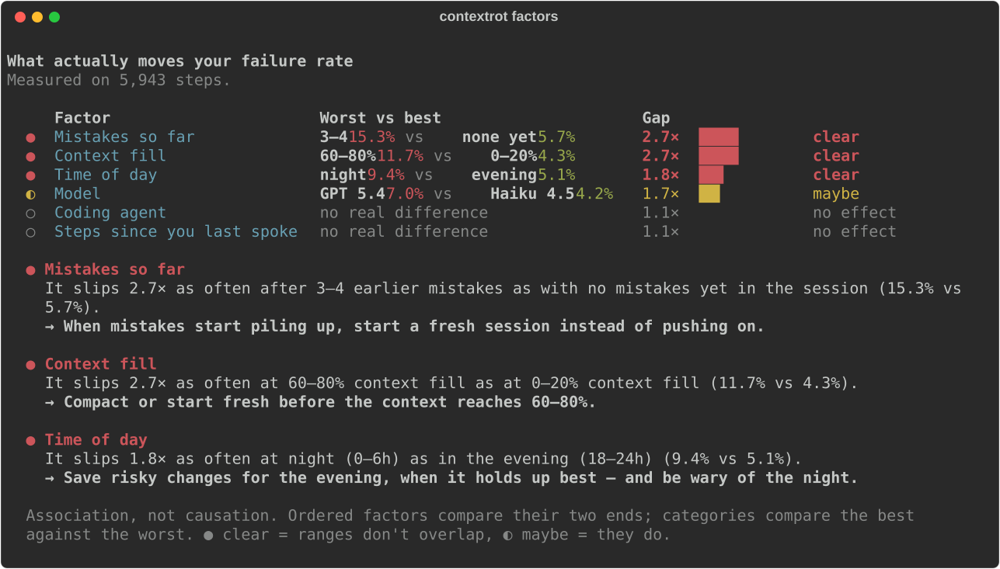
</div>

Notice *mistakes so far* at the top. In the dataset behind this image, failures were
generated **independently** of earlier failures — and the factor still lights up, because
sessions that have made more mistakes are, on average, deeper into their context. That's
confounding, it happens on real data too, and it's why the report says *association, not
causation* under every table.

## The full analysis

`contextrot --full`

The curve behind the verdict: failure rate per 10% of context fill with confidence ranges,
whether mistakes snowball, side-by-side comparisons, and where your context window actually
goes.

<div align="center">
  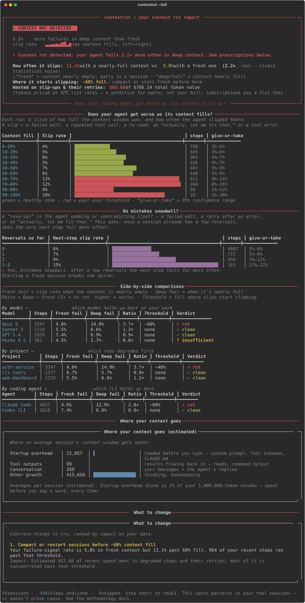
</div>

### As a single HTML file

`contextrot --html report.html`

The same analysis as one self-contained, offline HTML file with a downloadable image card —
something you can attach to a PR or post. Charts grow in as you scroll.

<div align="center">
  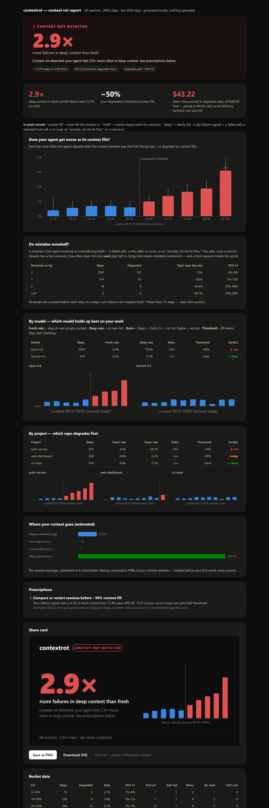
</div>

## Which of your repos degrades first?

`contextrot projects`

Each repo gets its own curve and verdict, worst first — so the one whose CLAUDE.md or MCP
setup is dragging you down stops hiding inside your all-projects average.

<div align="center">
  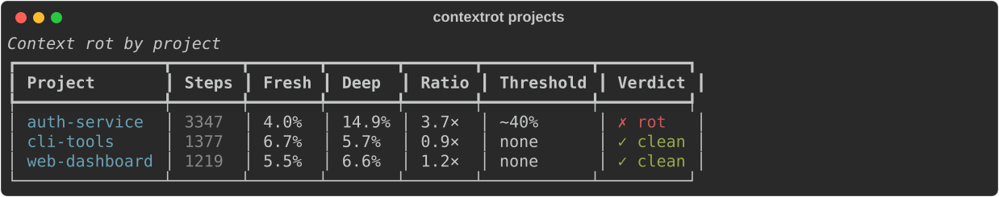
</div>

## Which coding agent holds up best?

`contextrot agents`

The same comparison across agent CLIs, measured on your work rather than a benchmark's.

<div align="center">
  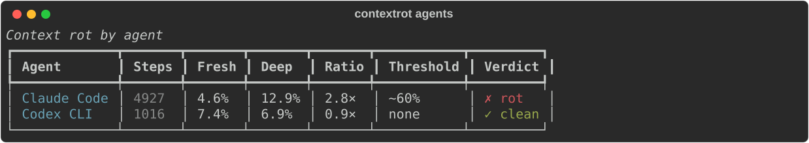
</div>

## Is it getting better?

`contextrot trends`

Week by week, with a bar so the direction is a shape rather than four percentages — and an
explicit call on whether the change clears statistical noise.

<div align="center">
  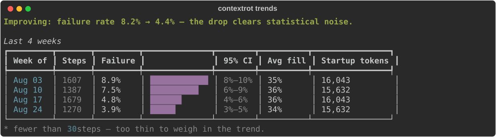
</div>

## What is it costing you?

`contextrot waste`

Usage trackers tell you what you spent. This tells you which part bought nothing — a call
that errored, an edit that missed, a re-read of a file already in context — ranked by cost.

<div align="center">
  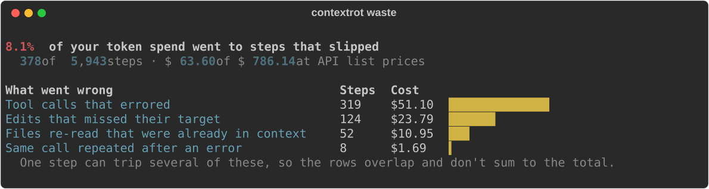
</div>

Costs are at API list prices, so on a subscription read them as "what this would have cost",
not a bill. One step can trip several signals, so the rows overlap, and the screen says so
rather than inventing a split.

## What should you change?

`contextrot fix`

The report's prescriptions as checkable actions, plus the size of your global CLAUDE.md and
the MCP servers you configured but never call — each one is overhead on every session.
Nothing changes until you add `--apply`, and even then only unused *global* servers are
disabled, reversibly, after a backup.

<div align="center">
  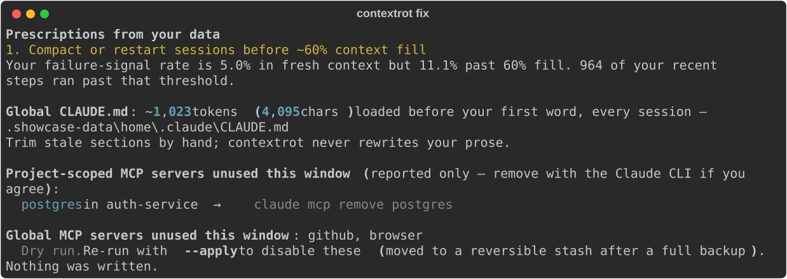
</div>

## Watch it live, inside Claude Code

`contextrot install statusline --apply`

A live meter, colored against *your* measured curve: how full the window is, how many
turns are left, and your Claude.ai rate limits. When nothing is wrong, it says nothing
about it — the green bar is the message.

<div align="center">
  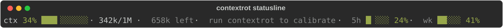
</div>

`contextrot install hook --apply` adds one warning the instant a session crosses your
threshold, then silence until the next crossing:

<div align="center">
  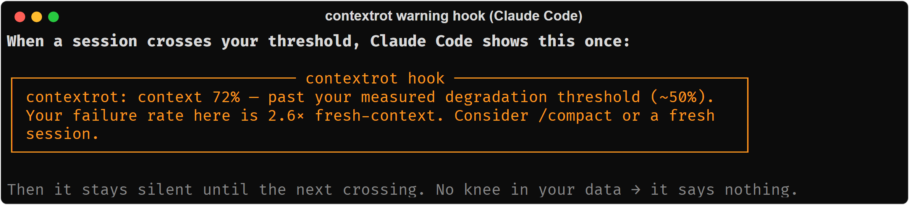
</div>

Not on Claude Code? `contextrot status` prints the same line for any agent — in tmux,
Starship or your prompt. `contextrot status --setup tmux` gives you the snippet.

## Share your curve

`contextrot share --copy`

Your curve as anonymized JSON — verdict, rates and step counts per fill bucket, which
factors moved your rate — copied to your clipboard. **It sends nothing.** Flat objects stay
on one line so you can actually read the whole thing before you paste it:

```json
{
  "schema": 1,
  "tool": "contextrot",
  "verdict": {"kind": "rot", "threshold_pct": 60, "fresh_rate": 0.0498, "deep_rate": 0.111, "ratio": 2.229, "significant": true, ...},
  "curve": [
    {"lo": 0, "hi": 10, "n": 788, "failures": 31},
    ...
    {"lo": 60, "hi": 70, "n": 611, "failures": 71},
    ...
  ],
  ...
}
```

No project names, paths, prompts, code, timestamps or costs, and private model names pooled
as `other`. Paste it into a
[Share your curve](https://github.com/Priyanshu-byte-coder/contextrot/issues/new?template=share_your_curve.yml)
issue. What's in it, exactly: [docs/sharing.md](docs/sharing.md).

## Why don't I have a verdict?

`contextrot doctor`

Your version, every agent it looked for and where, how much data a verdict needs and how
close you are, and every curve the live surfaces can quote from — narrowest first.

<div align="center">
  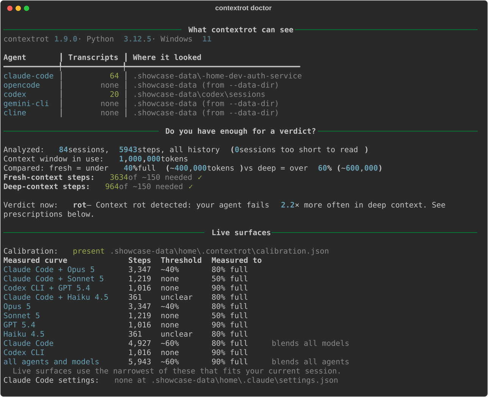
</div>

## And how much water did it take?

`contextrot water`

Inference runs in datacenters that evaporate water to stay cool, and the power stations
feeding them consume more. The tank fills while the number counts up, then the breakdown
says where it went — mostly cache reads, not the answers people assume dominate.

<div align="center">
  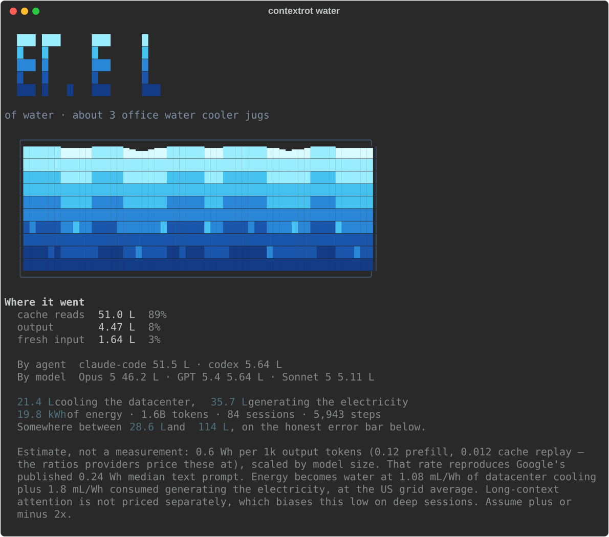
</div>

The one figure contextrot *estimates* rather than measures, and it always says so, with its
derivation and a plain ±2×. `contextrot water --live` animates it continuously in a split
pane; the `water` status-line segment shows the current session's running total.

<div align="center">
  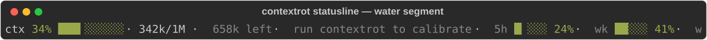
</div>

## What was parsed?

`contextrot sessions`

<div align="center">
  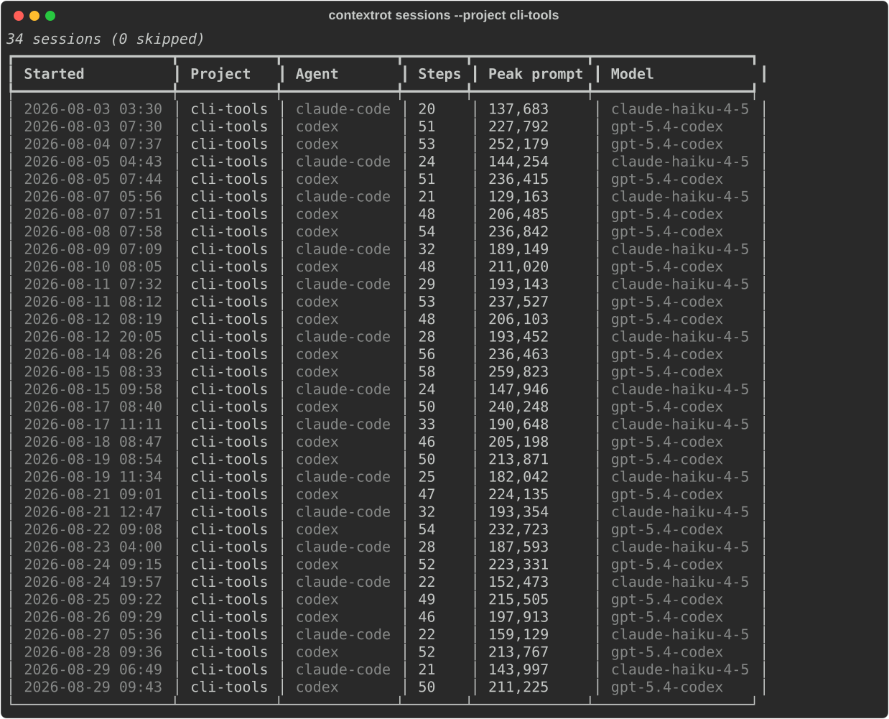
</div>

---

<div align="center">
  <p><code>uvx contextrot</code> — no config, no API keys, zero network calls.</p>
  <p><a href="docs/guide.md">The full guide</a> · <a href="docs/methodology.md">Methodology</a> · <a href="docs/sharing.md">Sharing</a></p>
</div>
